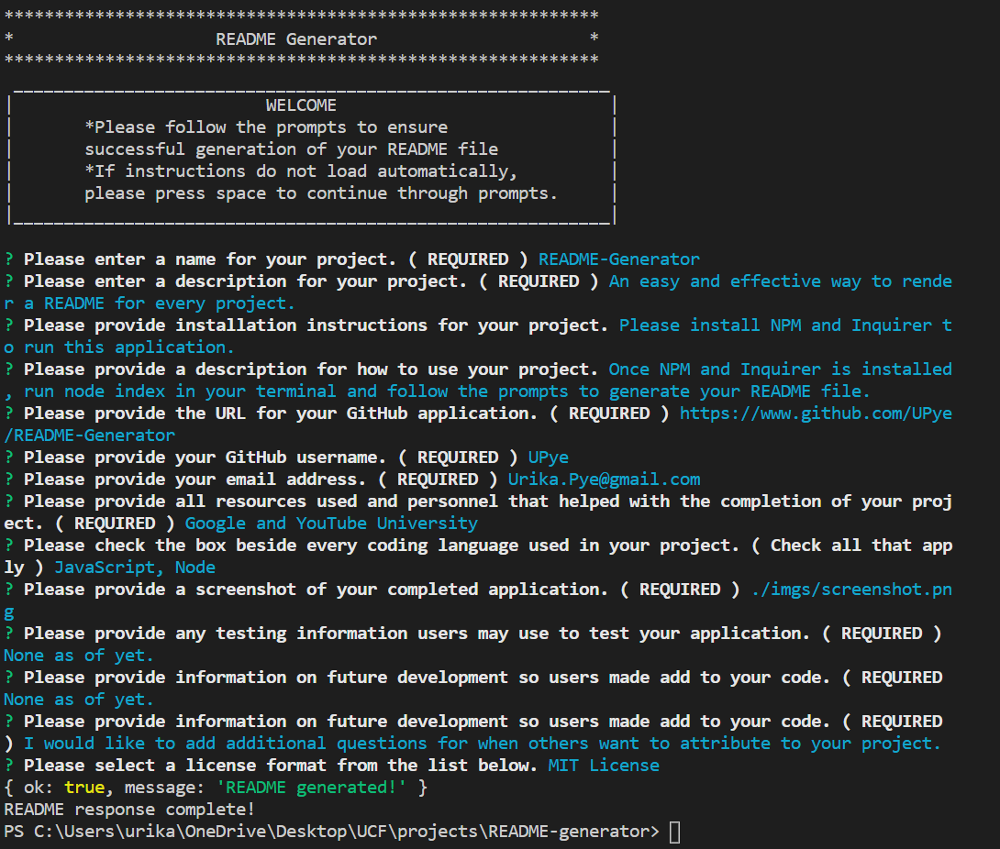

 
  # README-Generator 
  
  ## Table of Contents 
  
  * [Description](#description)
  * [Installation](#installation)
  * [GitHub](#github)
  * [Languages](#languages)
  * [Usage](#usage)
  * [Screenshot](#screenshot)
  * [Test](#test)
  * [Contributions](#contributions)
  * [Questions](#questions)
  * [Credit](#credit)
  * [License](#license)
  
  ## Description

  An easy and effective way to render a README for every project.
  
  ## Installation

  Please install NPM and Inquirer to run this application.  
  Link to GitHub Repository: https://www.github.com/UPye/README-Generator
  
  ## Languages
  
  JavaScript,Node
  
  ## Usage

  Once NPM and Inquirer is installed, run node index in your terminal and follow the prompts to generate your README file.

  ## Screenshot
    
  

  ## Test

  None as of yet.

  ## Contributions

  I would like to add additional questions for when others want to attribute to your project.

  ## Questions  

  GitHub Link: https://github.com/UPye
  
  Contact via Email: Urika.Pye@gmail.com

  ## Credit
  Google and YouTube University

  ## License
  
  
    